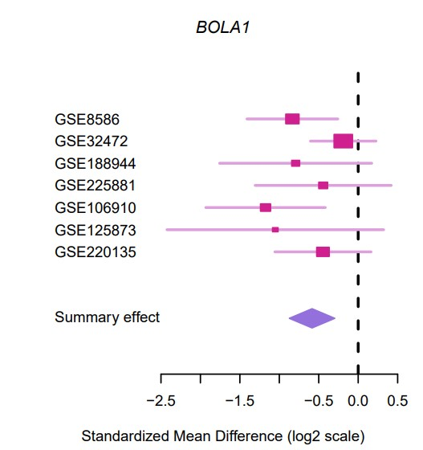
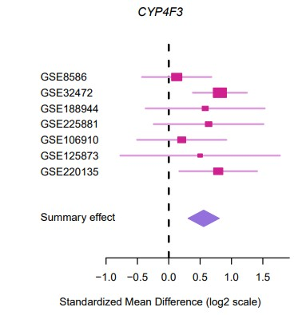
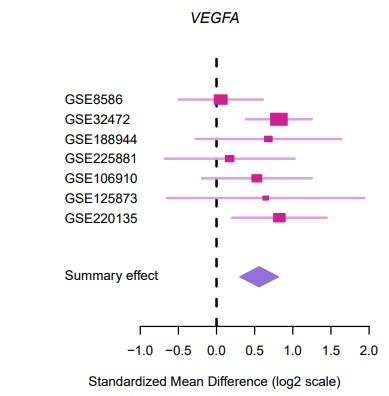

# GeneNormMeta
Effect size estimation, meta-analysis, and statistical testing for gene expression data.

A bioinformatics toolkit for computing effect sizes, pooling meta-analytic estimates, and performing statistical tests on gene expression data. 

This toolkit calculates summary effect sizes for individual genes, summarizes effect sizes across multiple studies, and determines statistical significance using t-statistics while accounting for variance assumptions. The output includes forest plots and a comprehensive table containing:
Effect sizes (Hedge's g/Cohen's d) for each gene, measuring the magnitude of expression between groups.
Summary effect sizes pooled across multiple datasets.
P-values and adjusted q-values, allowing for statistical significance assessment while controlling for false discovery rates.

These results can be used to identify genes or gene sets with differential expression across conditions, aiding in biomarker discovery and predictive modeling. Currently, this workflow only works for transcriptomic datasets but will be continue to be modified to accept other omic data.

K.S Pollard, S. Dudoit, M.J. van der Laan (2005). Multiple Testing Procedures: R multtest Package and
  Applications to Genomics, in Bioinformatics and Computational Biology Solutions Using R and Bioconductor,
  R. Gentleman, V. Carey, W. Huber, R. Irizarry, S. Dudoit (Editors). Springer (Statistics for Biology and
  Health Series), pp. 251-272.

T. E. Sweeney, A. Shidham, H. R. Wong, P. Khatri, A comprehensive time-course–
based multicohort analysis of sepsis and sterile inflammation reveals a robust diagnostic
gene set. Sci. Transl. Med. 7, 287ra71 (2015).
